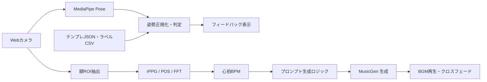

# Rhythmix

**Rhythmix** は、
**カメラ姿勢推定 + rPPG心拍推定 + 生成BGM** を組み合わせた
**リアルタイム・フィットネス/リズム体験**のプロトタイプです。

- 🟦 **姿勢マッチ**: MediaPipe Pose でお手本とユーザー姿勢を比較
- 🟥 **rPPG 心拍**: 額ROIのRGBから心拍(bpm)を推定
- 🟩 **BGM生成**: 心拍/動作強度を反映したBGMを連続生成
- 🟧 **クロスフェード**: 曲の切替を自然に接続

---

**クイックスタート**

```bash
docker compose up --build
```

```text
http://localhost:5173
```

**備考**
- バックエンドは `http://localhost:8000`
- GPU (NVIDIA) 前提の構成。初回はモデルDLに時間がかかります。

---

**システム概要**

🟦 **入力**
- Webカメラ映像
- ユーザープロンプト / 曲の長さ
- テンプレート骨格データ (JSON)
- ラベルCSV (`video_label.csv`)

🟧 **処理**
- MediaPipe Pose でユーザー骨格を推定
- テンプレ骨格と正規化比較して判定 (Good/OK/Bad)
- 額ROIのRGBから rPPG (POS法) で心拍推定
- 心拍/動作強度/前回BPMを元にBGM生成
- 曲終盤でクロスフェードし途切れない再生

🟩 **出力**
- 判定グレード + フィードバック
- BGMの継続再生
- 表示用BPM / 心拍ログ

---

**図解（データフロー）**



---

**主要仕様**

🟦 **姿勢判定**
- テンプレ骨格を時間方向に再生
- ユーザー骨格は「平行移動 + スケール正規化 (+回転補正)」
- 平均誤差で Good / OK / Bad を判定
- 関節ごとの誤差でフィードバック文を生成

🟥 **rPPG 心拍推定**
- 額ROIからRGB平均を取得
- POS法 + FFTでピーク周波数を抽出
- 信頼度や変化量でスムージング
- `/api/hr` に定期送信

🟩 **BGM 生成**
- 1曲目: ユーザープロンプト
- 2曲目以降: 直前BPM/心拍/動作強度から自動生成
- 曲末に向けてクロスフェード
- 生成後にBPM推定

🟧 **テンプレ/ラベル**
- `video_label.csv` に動作区間を定義
- JSONテンプレは各フレームのlandmarks配列

---

**API（コピー可能な例）**

**BGM生成** `POST /api/generate-bgm`

```json
{
  "prompt": "upbeat workout track",
  "duration": 15,
  "bpm": 120,
  "hr": 128,
  "intensity": 0.7
}
```

```json
{
  "success": true,
  "url": "http://localhost:8000/static/audio/bgm_xxx.wav",
  "bpm": 123,
  "prompt": "..."
}
```

**シンプル生成** `POST /api/generate-music`

```json
{
  "prompt": "upbeat workout track",
  "duration": 12
}
```

**テンポ推定（動画）** `POST /api/infer_tempo_by_events`

```bash
curl -X POST \
  -F "video=@/path/to/video.mp4" \
  "http://localhost:8000/api/infer_tempo_by_events"
```

```json
{
  "bpm": 120,
  "events": [0.3, 0.8, 1.3],
  "intervals": [0.5, 0.5]
}
```

**心拍ログ** `POST /api/hr`

```json
{
  "hr": 120,
  "confidence": 0.8
}
```

```json
{
  "ok": true
}
```

**テンプレ一覧** `GET /api/templates`

```json
["xxx.json", "yyy.json"]
```

**WebSocket** `/ws`

```text
任意の文字列を送信すると、他のクライアントにブロードキャストされます。
```

---

**ディレクトリ構成**

- `frontend/` : Vue + Vite クライアント
- `backend/` : FastAPI サーバ
- `backend/static/` : テンプレや音源など静的ファイル
- `backend/static/templates/` : お手本ポーズ(JSON)
- `backend/static/video_label.csv` : セグメント定義

---

**開発 (ローカル)**

フロントエンド:

```bash
cd frontend
npm install
npm run dev -- --host 0.0.0.0 --port 5173
```

バックエンド:

```bash
cd backend
pip install -r requirements.txt
uvicorn app.main:app --host 0.0.0.0 --port 8000 --reload
```

---

**注意点 / 既知の問題**

- `docker-compose.yml` は外部テンプレを `/home/taku/test0/poses` からマウントします。
  そのパスが存在しないとテンプレが空になります。
- `backend/Dockerfile` は `pytorch:2.1.0-cuda11.8` を使用。
  `backend/requirements.txt` では `torch>=2.6.0` を要求しているため、
  バージョン差分が起きる場合があります。
- カメラは HTTPS か localhost でのみ許可されることがあります。
- `ScoreDisplay` は現状プレースホルダーです。

---

**技術スタック**

- フロントエンド: Vue 3, Vite, TypeScript, MediaPipe Pose
- バックエンド: FastAPI, PyTorch, Audiocraft MusicGen, Librosa
- その他: rPPG(POS), WebSocket

---

**用語集**

- **rPPG**: 皮膚の微小な色変化から心拍を推定する手法。ここでは額ROIのRGB平均を使い、POS法 + FFTでBPMを推定します。
- **POSE (MediaPipe Pose)**: カメラ画像から人体の骨格（ランドマーク）を推定するモデル/ライブラリ。
- **テンプレ**: お手本の動作骨格。`backend/static/templates/*.json` にフレームごとのランドマーク列として保存され、`video_label.csv` の区間に対応します。
